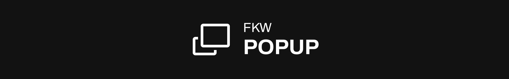

React Popup component written on Typescript. Compatible with Next & Vite!

<!-- **[Live examples](https://example.com)** -->

## Features
- **Closing dialog on Escape or by click on Layout**
- Smooth scroll hiding without reseting content
- Manipulating Dialog state out of component
- Will return focus to the button that triggered opening
- Possibility to prevent user change state of popup
- Flexible settings
- Fancy in-box styling
- Implements [WAI-ARIA Dialog](https://www.w3.org/WAI/ARIA/apg/patterns/dialog-modal/) pattern


## Examples
<!-- **[Live examples](https://example.com)** -->

Import components and styles
```tsx
import { Layer, Dialog, Trigger } from "@fullkekw/fkw-popup";

import '@fullkekw/fkw-popup/css';
```

You can add inbox pretty styles by adding ```fkw-popup--fancy``` class to Layer component

### Default implementation
Default implementation + state observing of Popup Component
```tsx
const Component: React.FC = () => {
  const [id_1] = useState<string>('popup-1');
  const [isOpen, setIsOpen] = useState(true);

  // Observe popup state changes
  useEffect(() => console.log(isOpen), [isOpen])

  return (
    <div>
      <Layer className="fkw-popup--fancy" settings={{}}>
        <Dialog id={id_1} stateSetter={setIsOpen}>
          <p>DIALOG 1</p>

          <Trigger id={id_1}>
            <p>TRIGGER 1</p>
          </Trigger>
        </Dialog>
      </Layer>

      <Trigger id={id_1}>
        <p>TRIGGER 1</p>
      </Trigger>
    </div>
  );
};
```


### Custom state handling
Implement custom state changing. Popup will be opened initially
```tsx
const Component: React.FC = () => {
  const [id_1] = useState<string>('popup-1');
  const [isOpen, setIsOpen] = useState(true);

  // Observe popup state changes
  useEffect(() => console.log(isOpen), [isOpen])

  // Reverse popup state after 3 seconds
  useEffect(() => {
    setTimeout(() => {
      setIsOpen(prev => !prev)
    }, 3000)
  }, [])

  return (
    <div>
      <Layer className="fkw-popup--fancy" settings={{}}>
        <Dialog id={id_1} state={isOpen} stateSetter={setIsOpen}>
          <p>DIALOG 1</p>

          <Trigger id={id_1}>
            <p>TRIGGER 1</p>
          </Trigger>
        </Dialog>
      </Layer>

      <Trigger id={id_1}>
        <p>TRIGGER 1</p>
      </Trigger>
    </div>
  );
};
```

### Prevent user from closing popup
Popup will be initially opened and user can not close it
```tsx
const Component: React.FC = () => {
  const [id_1] = useState<string>('popup-1');
  const [isOpen, setIsOpen] = useState(true);

  // Observe popup state changes
  useEffect(() => console.log(isOpen), [isOpen])

  // Reverse popup state after 3 seconds
  useEffect(() => {
    setTimeout(() => {
      setIsOpen(prev => !prev)
    }, 3000)
  }, [])

  return (
    <div>
      <Layer className="fkw-popup--fancy" settings={{preventUserInteractions: true}}>
        <Dialog id={id_1} state={isOpen} stateSetter={setIsOpen}>
          <p>DIALOG 1</p>

          <Trigger id={id_1}>
            <p>TRIGGER 1</p>
          </Trigger>
        </Dialog>
      </Layer>

      <Trigger id={id_1}>
        <p>TRIGGER 1</p>
      </Trigger>
    </div>
  );
};
```

## API
Open popup will hide any elements with tabindex. To prevent this, add ```fkw-prevent_hideIndexes``` class to element with tabindex.
Trigger which open popup will have ```fkw-popup-trigger_triggeredBy``` class

```ts
export interface IPopupSettings {
  /** Hide body scroll when popup is active
   * @default true
   */
  hideScroll?: boolean

  /** Close popup on escape
   * @default true
   */
  exitOnEscape?: boolean

  /** Close popup by clicking on the layer
   * @default true
   */
  exitOnLayer?: boolean

  /** Prevent user from changing popup state
   * @default false
   */
  preventUserInteractions?: boolean
}


interface ILayerProps {
  children: React.ReactNode | React.ReactNode[]
  className?: string

  /** Popup settings */
  settings?: IPopupSettings
}

interface IDialogProps {
  children: React.ReactNode | React.ReactNode[]
  className?: string

  /** Popup ID */
  id: string

  /** Out state */
  state?: boolean

  /** Out state setter */
  stateSetter?: (state: boolean) => void
}

interface ITriggerProps {
  children: React.ReactNode | React.ReactNode[]
  className?: string
  onClick?: () => void

  /** Popup ID */
  id: string
}

/** Popup layer */
export const Layer: React.FC<ILayerProps>

/** Popup dialog */
export const Dialog: React.FC<IDialogProps>

/** Popup trigger. Already returning button element, nesting anither one can cause Hydration error in Next.JS */
export const Trigger: React.FC<ITriggerProps>
```

## Handlers
```ts
/** Hide scrollbar with saving scroll width
 * @param extendElement HTML element to extend. Default - document.body
 */
export function toggleScroll(hide: boolean, extendElement?: HTMLElement)

/** Hide tab indexes 
 * Will store them in data-fkw-prevTabIndex
 * @param except Class that this function will pass. Will except fkw-prevent_hideIndexes by default
*/
export function hideTabIndexes(except?: string)

/** Return tab indexes from data-fkw-prevTabIndex */
export function showTabIndexes()

/** Force element focus */
export function forceFocus(el: HTMLElement)
```

## Get it now!
```bash
npm install @fullkekw/fkw-popup
```

Licensed under MIT <br>
fullkekw © 2023 - 2024